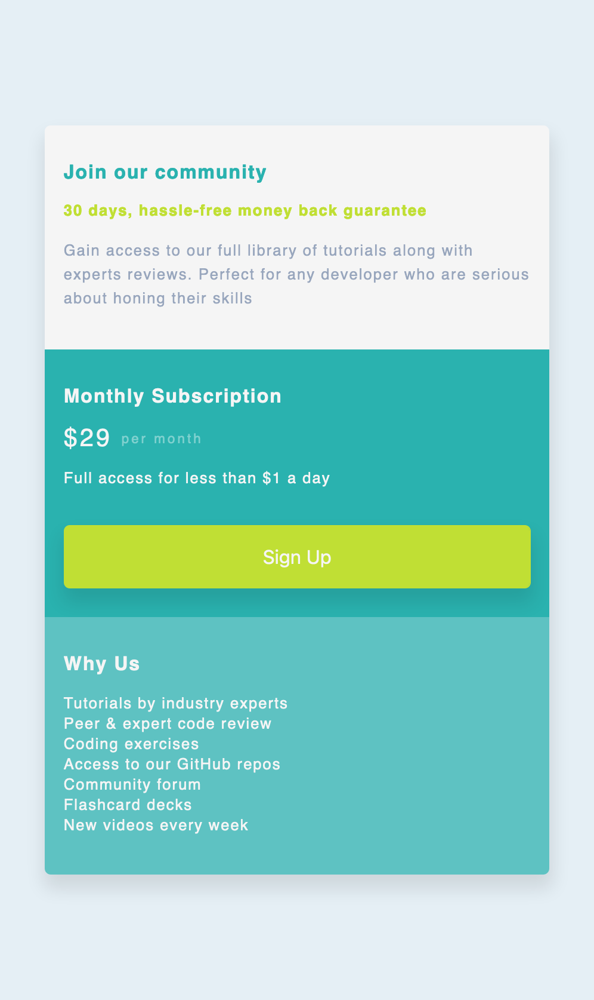
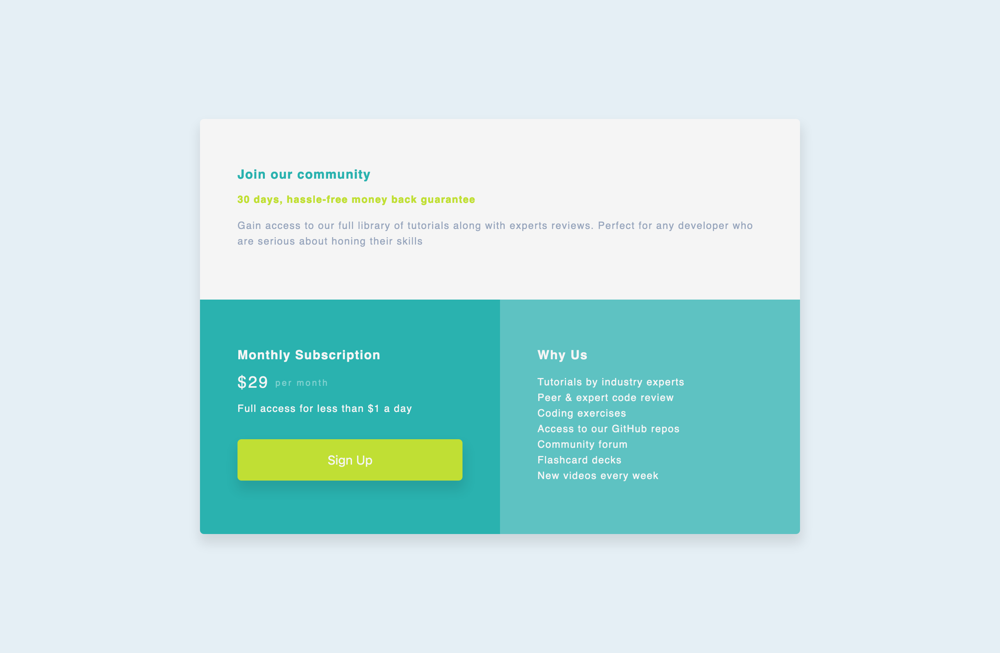

## Table of contents

- [Overview](#overview)
  - [The challenge](#the-challenge)
  - [Screenshot](#screenshot)
  - [Links](#links)
- [My process](#my-process)
  - [Built with](#built-with)
  - [What I learned](#what-i-learned)
  - [Continued development](#continued-development)
  - [Useful resources](#useful-resources)
- [Author](#author)
- [Acknowledgments](#acknowledgments)

## Overview

Single price grid component challenge is a challenge I used to practice what I have learnt about HTML and CSS of recent, so this project only contains two files and two other screenshot images. I have also included the the link to live url publish through the github pages.

### The challenge

Users should be able to:

- View the optimal layout for the component depending on their device's screen size
- See a hover state on desktop for the Sign Up call-to-action

### Screenshot




### Links

- Solution URL: [Solution URL here](https://github.com/ahmedsaliuGit/single-price-grid-component)
- Live Site URL: [Live site URL here](https://ahmedsaliugit.github.io/single-price-grid-component/)

## My process

- Download base template from Frontend Mentor
- Create repository for the project
- Start coding the HTML
- Then write CSS and do check and balance
- Add, Commit and Push to the repository
- Publish through GitHub Pages

### Built with

- Semantic HTML5 markup
- CSS properties
- Flexbox
- Mobile-first workflow

### What I learned

I learn two things in this project

- CSS centering element
- CSS box-shadow

```css
.center-element {
  margin: 0;
  position: absolute;
  top: 50%;
  left: 50%;
  -ms-transform: translate(-50%, -50%);
  transform: translate(-50%, -50%);
}

.box-shadow-selector {
  box-shadow: offsetX offsetY radius-blur spread-radius color;
}
```

### Continued development

Area I would like to focus more on is responsive layouts

### Useful resources

- [3schools](https://www.w3schools.com/html/) - This helped me learn how to center element and responsive on all devices.
- [MDN](https://developer.mozilla.org/) - This is an amazing docs page, learnt box-shadow here. I'd recommend it to anyone still learning HTML and CSS.

## Author

- Website - [Ahmed Saliu](https://ahmedsaliugit.github.io/resume/)
- Frontend Mentor - [@ahmedsaliuGit](https://www.frontendmentor.io/profile/ahmedsaliuGit)
- Twitter - [@ahmedsaliu](https://twitter.com/ahmedsaliu)

## Acknowledgments

Kudos to Frontend mentor for given me a platform to become better in what I want to do with my life.
